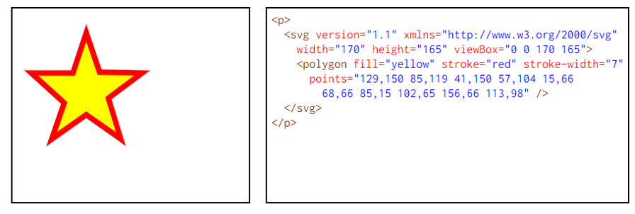

#ESTA ES LA ACTIVIDAD 3

*¿Qué es SVG? Busca un ejemplo*

RESPUESTA: Es un nuevo estándar usado para la creación y representación de gráficos e imágenes vectoriales en las páginas web y aplicaciones de internet.

